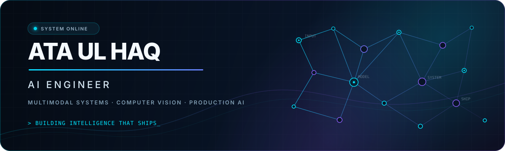

<!--
  GitHub Profile README for @Atasatti
  Keep the hero image at assets/hero.svg when uploading this file.
-->

<div align="center">
  
</div>

<br />

<div align="center">
  <a href="https://www.linkedin.com/in/ata-satti">
    
  </a>
  <a href="https://github.com/Atasatti">
    
  </a>
</div>

## `> whoami`

I’m **Ata Ul Haq**, an **AI Engineer** based in Islamabad, Pakistan, working with **[Oscillation Records](https://www.oscillationrecords.com/)** in Chorley, United Kingdom.

I build AI systems that ship, not demos. My work connects **multimodal machine learning, computer vision, RAG, backend engineering, and product UX** to turn models into dependable, useful software.

```text
multimodal input  →  intelligence layer  →  production API  →  human-centered product
```

- 🛡️ Building multimodal safety systems across text, image, audio, and video
- 🎨 Creating multi-provider generative AI tools and 3D workflows
- 🧠 Developing medical computer vision and decision-support products
- 🔎 Engineering grounded AI experiences with RAG and domain knowledge
- ⚙️ Taking products end to end, from model inference to APIs, interfaces, cloud storage, and deployment

## Active / Flagship Products

| Product | Scope | Build and proof |
| :--- | :--- | :--- |
| **Orvia Labs** | Multi-provider AI creative studio with prompt optimization, remix workflows, layered editing, and video creation. | Next.js · React · FastAPI · Python<br>**[Watch demo ↗](https://youtu.be/-5e21EvldGg)** |
| **[Aegis](https://github.com/Atasatti/Aegis-Content_Moderator)** | Independent AI safety workspace that gives teams one consistent review experience for text and media, with clear decisions, case history, and operator-focused reporting. | Standalone product<br>**[Watch demo ↗](https://youtu.be/9hSEKJ_aumE)** |
| **Orvia 3D Arts** | End-to-end sketch to photorealistic image to 3D asset pipeline with an interactive browser-based preview. | Next.js · Three.js · FastAPI · PyTorch<br>**[Watch demo ↗](https://youtu.be/f-yHO4Eawu4)** |
| **[Dental AI](https://github.com/Atasatti/Dental_AI)** | Oral diagnosis SaaS with a six-class RGB image pipeline, X-ray implant-feasibility analysis, patient and dentist dashboards, scheduling, a RAG assistant, and billing. | FastAPI · React · PyTorch · MongoDB<br>**[Watch demo ↗](https://www.youtube.com/watch?v=PzzG26pMPjs)** |

## Professional / Client Work

| Product | Scope | Build and proof |
| :--- | :--- | :--- |
| **[Oscillation Records](https://github.com/Atasatti/oscillationrecords)** | Production platform for a UK independent record label. Supports artists, releases, streaming, submissions, user accounts, analytics, and content management. | Next.js · TypeScript · Prisma · MongoDB · NextAuth · AWS S3<br>**[Visit live site ↗](https://www.oscillationrecords.com/)** |
| **[Content Moderation System](https://github.com/Atasatti/ConvrtX-Memee_Content_Moderator)** | Custom client solution created for ConvrtX/Memee to support internal content operations, platform integration, and moderation workflows within an existing product environment. | Professional client delivery<br>Implementation details private |

## Earlier / Foundational Projects

| Project | What it demonstrates | Core stack |
| :--- | :--- | :--- |
| **[NeuroVision AI](https://github.com/Atasatti/NeuroVision-AI)** | MRI brain-tumor detection with classification, visual localization, confidence scoring, and web-based inference. | PyTorch · FastAPI · OpenCV |
| **[Potato Disease Classifier](https://github.com/Atasatti/Potato_disease_Classification)** | Deep-learning classification for Early Blight, Late Blight, and healthy potato leaves. | Keras · FastAPI · OpenCV |
| **[Data Visualization & Analytics](https://github.com/Atasatti/PowerBI_Dashboards)** | Airline-loyalty and retail business-intelligence dashboards with exploratory analysis and decision-focused reporting. | Power BI · Python · MySQL · Matplotlib · Seaborn |
| **[Voyage Vista](https://github.com/Atasatti/Voyage_Vista)** | Travel-management system with authentication, package management, reviews, and persistent data workflows. | FastAPI · MongoDB Atlas · Jinja2 |

## Technology radar

**AI, machine learning & data**


**Systems, product & cloud**


## Engineering principles

```yaml
focus:
  - useful intelligence over impressive demos
  - measurable behavior over vague capability
  - secure APIs and clear failure modes
  - products that keep humans in control
```

## Let’s build what comes next

I’m interested in ambitious work across **applied AI, multimodal systems, computer vision, AI safety, and AI-native products**.

<div align="center">
  <strong>Have a hard problem where AI needs to work in the real world?</strong>
  <br /><br />
  <a href="https://www.linkedin.com/in/ata-satti">
    
  </a>
</div>

<br />

<div align="center">
  <sub>Designed and engineered with curiosity, discipline, and a bias toward shipping.</sub>
</div>
